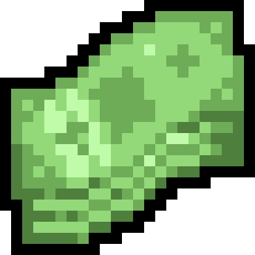
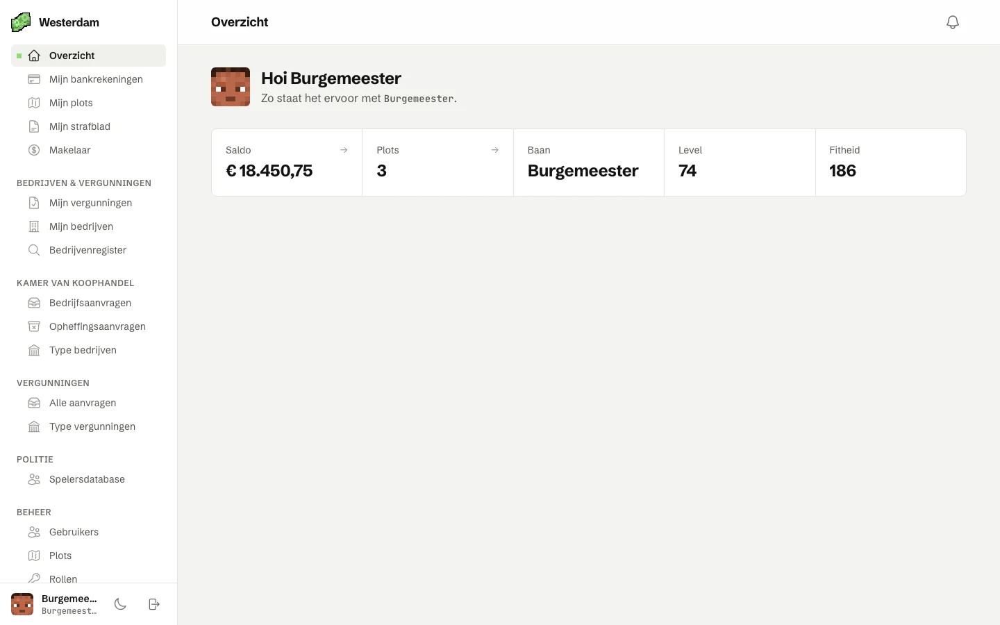
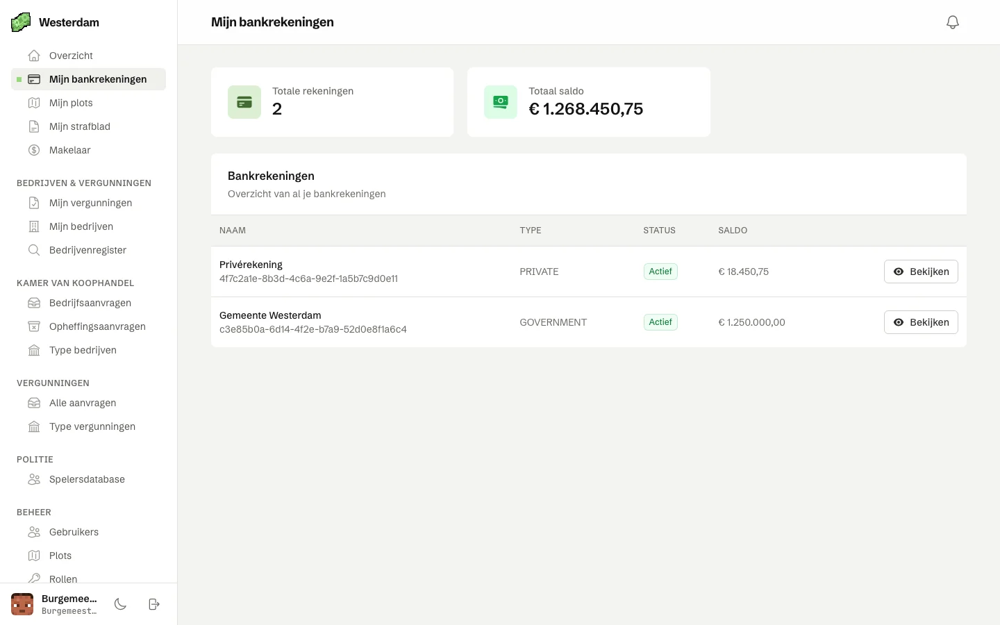
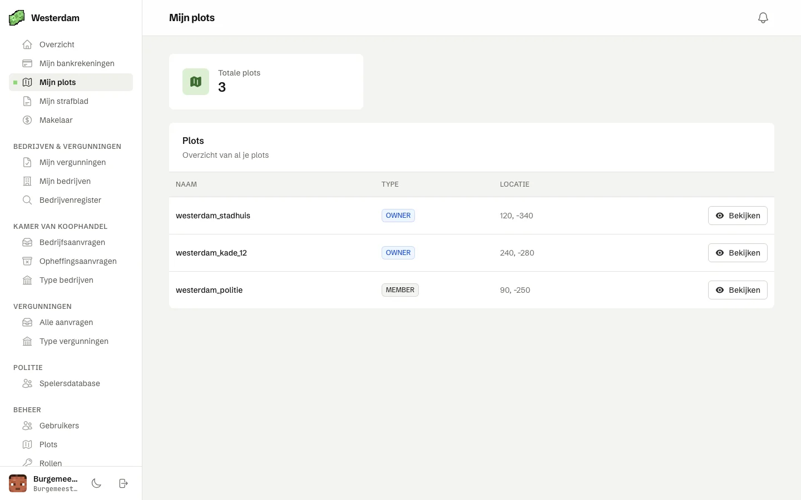
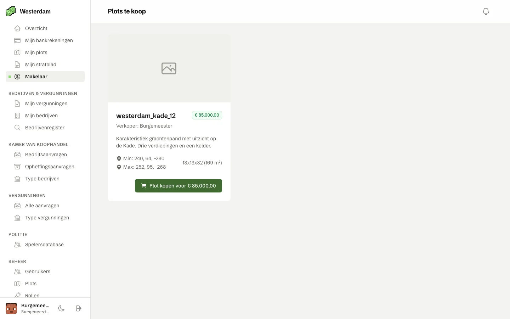
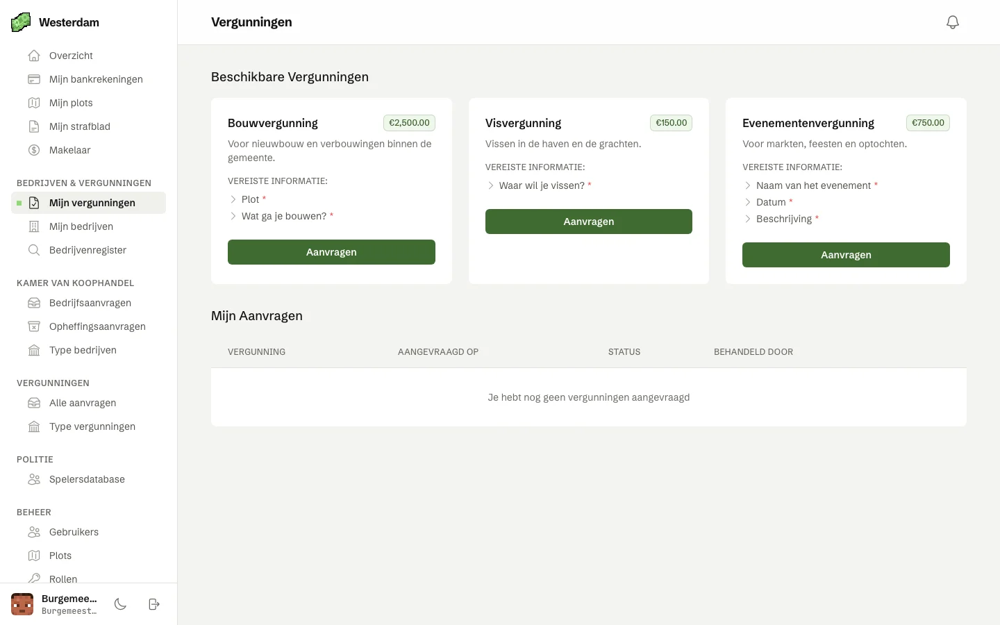
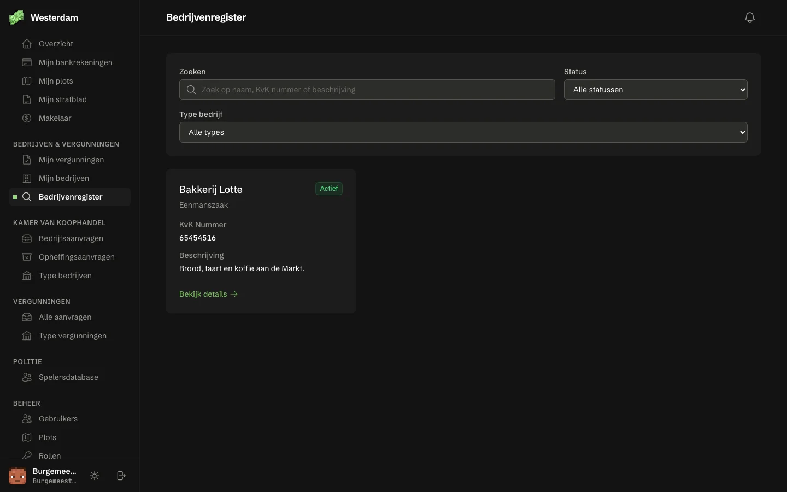
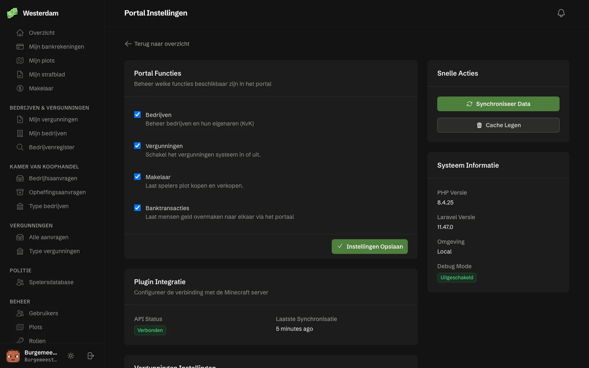

<p align="center">
  
</p>

<h1 align="center">OpenMinetopia Portal</h1>

<p align="center">
  Het webportaal voor je Minetopia-server met de <a href="https://github.com/OpenMinetopia/openminetopia">OpenMinetopia-plugin</a>.<br>
  Spelers zien in de browser hun bankrekeningen, plots, strafblad en meer, en regelen er bedrijven en vergunningen.
</p>

<p align="center">
  <a href="LICENSE"></a>
  <a href="https://github.com/OpenMinetopia/portal/actions/workflows/tests.yml"></a>
  <a href="https://discord.gg/6E3p8mPSVf"></a>
</p>

<p align="center">
  <picture>
    <source media="(prefers-color-scheme: dark)" srcset="docs/screenshots/dashboard-dark.webp">
    
  </picture>
</p>

## Twee manieren

**Wij hosten het voor je.** Maak gratis een portaal aan op [openminetopia.nl](https://openminetopia.nl). Je krijgt een adres als `jouwserver.mtportal.nl` (of je eigen domein) en verlengt het elke drie maanden. Je hoeft niets te installeren.

**Je host het zelf.** Op je eigen server, met Docker in één commando:

```bash
curl -fsSL https://raw.githubusercontent.com/OpenMinetopia/portal/main/install.sh | sudo bash
```

Het script stelt een paar vragen (adres, naam van je server, waar de plugin draait), start het portaal met een database, en laat daarna zien wat je in de `config.yml` van de plugin zet en hoe je beheerder wordt.

## Wat kan het?

- **Bank:** je rekeningen en saldo, en geld overmaken naar andere spelers.
- **Plots:** je plots met eigenaren en leden; eigenaren beheren wie erbij mag.
- **Makelaar:** plots te koop zetten en kopen, met betaling via de bank.
- **Bedrijven:** een bedrijf inschrijven bij de Kamer van Koophandel, het bedrijvenregister, en opheffen.
- **Vergunningen:** vergunningen aanvragen; de juiste rol beoordeelt ze.
- **Politie:** een spelersdatabase met strafbladen voor agenten.
- **Strafblad:** spelers zien hun eigen strafblad.
- **Beheer:** gebruikers, rollen en rechten, en per onderdeel aan of uit.
- **Koppelen:** spelers koppelen hun account in Minecraft met `/koppel`.
- Licht en donker thema, en alles in het Nederlands.

<table>
  <tr>
    <td></td>
    <td></td>
  </tr>
  <tr>
    <td></td>
    <td></td>
  </tr>
  <tr>
    <td></td>
    <td></td>
  </tr>
</table>

## Zelf hosten

### Met Docker (aanbevolen)

Nodig: een Linux-server met Docker. Heb je Docker nog niet, dan biedt het script aan het te installeren.

- **Met een domeinnaam** krijgt je portaal automatisch HTTPS. Laat de domeinnaam eerst naar je server wijzen, en zorg dat poort 80 en 443 open staan.
- **Zonder domeinnaam** draait het portaal op het IP-adres van je server, zonder HTTPS.

Na de installatie beheer je alles met één commando:

| Commando | Wat het doet |
| --- | --- |
| `openminetopia-portal update` | Nieuwste versie ophalen en herstarten |
| `openminetopia-portal backup` | Database en geüploade bestanden opslaan |
| `openminetopia-portal check` | Test of het portaal de plugin bereikt |
| `openminetopia-portal admin-link` | Nieuwe eenmalige link om beheerder te worden |
| `openminetopia-portal instellen` | Naam, adres of plugin opnieuw instellen |
| `openminetopia-portal logs` | Meekijken wat het portaal doet |

Alles staat in `/opt/openminetopia-portal`. Liever zonder vragen, bijvoorbeeld in een script? Dat kan met omgevingsvariabelen; die staan bovenaan [`install.sh`](install.sh).

### Met Pterodactyl

1. Importeer [`pterodactyl/egg-openminetopia-portal.json`](pterodactyl/egg-openminetopia-portal.json) in je panel (Admin → Nests → Import Egg).
2. Maak een server met dit egg en maak op het tabblad **Databases** een database aan.
3. Vul bij **Startup** de naam, het adres, de plugin en de databasegegevens in.
4. Start de server. De console laat zien wat je in de `config.yml` van de plugin zet, en een link om beheerder te worden.

Pterodactyl geeft het portaal een poort met HTTP. Wil je HTTPS, zet er dan een reverse proxy (zoals nginx of Caddy) of Cloudflare voor.

### Zelf installeren

Nodig: PHP 8.4 met de extensies `pdo_mysql`, `intl`, `zip` en `bcmath`, Composer, Node.js 22, en MySQL, MariaDB of SQLite.

```bash
git clone https://github.com/OpenMinetopia/portal.git
cd portal
composer install --no-dev --optimize-autoloader
npm ci && npm run build
php artisan portal:install
```

Laat je webserver (nginx, Apache, Caddy) naar de map `public` wijzen. Bijwerken doe je met `git pull`, dezelfde `composer` en `npm` commando's, en `php artisan migrate --force`.

## De plugin koppelen

`portal:install` (en dus het installatiescript en het Pterodactyl-egg) laat precies zien wat je in `plugins/OpenMinetopia/config.yml` zet, met je eigen sleutels:

```yaml
rest-api:
  enabled: true
  host: 0.0.0.0
  port: 4567
  api-key: plt_…
portal:
  enabled: true
  url: portaal.jouwserver.nl
  token: ist_…
```

Herstart daarna de Minecraft-server en test de verbinding met `openminetopia-portal check` (of `php artisan portal:check`).

Koppelen met `/koppel` gaat in de huidige plugin altijd via HTTPS. Draait je portaal zonder HTTPS, dan werkt koppelen pas met een plugin-versie die `http://` in `portal.url` ondersteunt.

## E-mail

Spelers die hun wachtwoord vergeten zijn, krijgen een link per e-mail. Daarvoor heeft het portaal een mailserver nodig. Zet je SMTP-gegevens in de `.env` van het portaal (bij Docker is dat `portal.env` in `/opt/openminetopia-portal`, bij Pterodactyl `.env` in de File Manager):

```dotenv
MAIL_MAILER=smtp
MAIL_HOST=smtp.jouwprovider.nl
MAIL_PORT=587
MAIL_USERNAME=portaal@jouwserver.nl
MAIL_PASSWORD=…
MAIL_FROM_ADDRESS=portaal@jouwserver.nl
MAIL_FROM_NAME="Jouw Portaal"
```

Herstart daarna het portaal (bij Docker: `docker compose restart portal` in `/opt/openminetopia-portal`). Zonder mailserver komen de e-mails in `storage/logs/laravel.log` terecht en niet bij de speler.

## Proberen zonder Minecraft-server

Zet `PORTAL_DEMO=true` in `.env` en laad de demodata:

```bash
php artisan db:seed --class=DemoSeeder
```

Log in met `demo@openminetopia.nl` en wachtwoord `demo1234`. De plugin wordt dan nagebootst met een verzonnen stad. Demo-modus werkt nooit als `APP_ENV=production`.

## Meer weten

- Documentatie over de plugin en het portaal: [wiki.openminetopia.nl](https://wiki.openminetopia.nl)
- Hulp en vragen: [Discord](https://discord.gg/6E3p8mPSVf)
- Bugs en ideeën: [issues](https://github.com/OpenMinetopia/portal/issues)

## Meedoen

Bijdragen zijn welkom; lees eerst [CONTRIBUTING.md](CONTRIBUTING.md). Een beveiligingsprobleem meld je zoals in [SECURITY.md](SECURITY.md) staat.

## Licentie

OpenMinetopia Portal is open source onder de [GNU General Public License v3.0](LICENSE).
